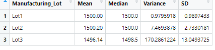
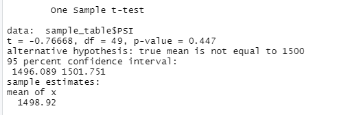
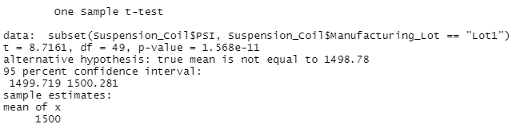
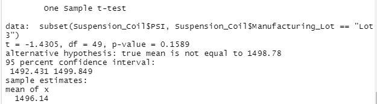
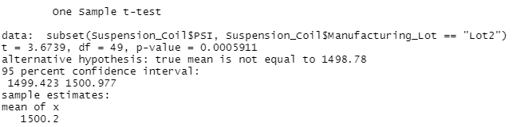

# MechaCar_Statistical_Analysis

## Overview

In this challenge,we were to do the following:

* Perform multiple linear regression analysis to identify which variables in the dataset predict the mpg of MechaCar prototypes
* Collect summary statistics on the pounds per square inch (PSI) of the suspension coils from the manufacturing lots
* Run t-tests to determine if the manufacturing lots are statistically different from the mean population
* Design a statistical study to compare vehicle performance of the MechaCar vehicles against vehicles from other manufacturers. For each statistical analysis, you’ll write a summary interpretation of the findings.

## Linear Regression to Predict MPG

* Which variables/coefficients provided a non-random amount of variance to the mpg values in the dataset?
  In this instance the variable that provide a non random amount of variance were vehicle length and ground clearance as they were both below the p-value of 0.05%.
* Is the slope of the linear model considered to be zero? Why or why not?
  With this linear models slope it would be considered to not be zero.  The reasoning behind this is that due to the p-value being so far below the 0.05% it would make us infer    that we will need to regect the hypothesis.
* Does this linear model predict mpg of MechaCar prototypes effectively? Why or why not?
  As for this linear model predicting MPG of MechaCar prototypes effectively you would have to say yes.  The resoning is that R-Squared value is 72%, meaing that for 72% of the time our prototypes predict properly.
  
## Summary Statistics on Suspension Coils

* The design specifications for the MechaCar suspension coils dictate that the variance of the suspension coils must not exceed 100 pounds per square inch. Does the current  manufacturing data meet this design specification for all manufacturing lots in total and each lot individually? Why or why not?
  When we processed the lots as a whole the variance is well below the 100 pound limit sitting at 62.3.  There was one outlier in our lot summary and that was for the third lot as it was way above the 100 pount limit for it came in at 170.3.
  
  
  
  ## T-Tests on Suspension Coils
  
  * Perform t-tests to determine if all manufacturing lots and each lot individually are statistically different from the population mean of 1,500 pounds per square inch.
  In each T-Test you are able to see that the population mean of 1,500 pounds is different in each one.  There are some that are basically the same as 1,500 but not exact and the others are closer to 1492 as shown.
  
 
  
 

## Study Design: MechaCar vs Competition

* What metric or metrics are you going to test? 
  The metrics that are going to be tested are the maintenance cost of a vehicle over a year to five years time.
* What is the null hypothesis or alternative hypothesis?
  Our hypothesis would be that over time the longer you own a vehicle the more your maintenance cost will be.
* What statistical test would you use to test the hypothesis? And why?
  One test we could run for this is an ANOVA test. This is a great test for showing us whether or not we have incurred more cost on maintenance on an older vehicle.
* What data is needed to run the statistical test?
  We will need a list of people purchasing cars during our test period. We will also need the list of expenses that these vehilces had during our test.
